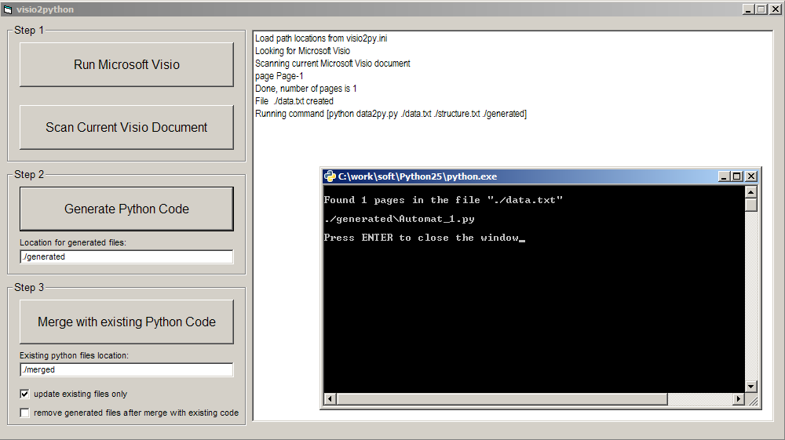
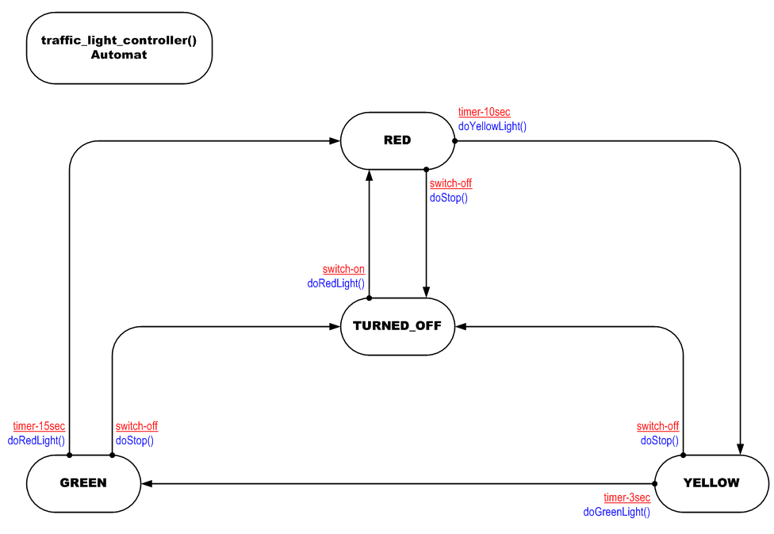

visio2python - Draw your Program in Microsoft Visio
===================================================

I would like here to tell you about another way to write programs.
Certainly nothing fundamentally new in science, I will not open.
But I created a small utility called **visio2python** that really helps me during development of 
the [BitDust](http://bitdust.io) project, so it might be usefull for other developers.

The tool **visio2python** generates [Python](http://python.org) code from graphical diagrams created in 
[Microsoft Visio](http://en.wikipedia.org/wiki/Microsoft_Visio). 
So you can "draw" your idea, press the button, execute automatically generated Python code and see how it works. 
Less code, more visualisation, fast development, more stability.
 

 
The key aspect here is the use of [finite state machines](http://en.wikipedia.org/wiki/Finite-state_machine) 
to describe behaviour of your program. 
This approach also known as [Automata-Based Programming](http://en.wikipedia.org/wiki/Automata-Based_Programming).
My professor [Anatoly Abramovich Shalyto](http://en.wikipedia.org/wiki/Anatoly_Shalyto) 
gave me that knowledge - those wonderful days when I was studying
[at university](http://en.ifmo.ru/). Great Thanks to Him!.
 

 
Anatoly Abramovich Shalyto is a Russian scientist, doctor of sciences, professor, 
awarded by Russian State Government in 2008 for achievements in education, 
developer of technology for Automata-based programming named "Switch-technology", 
initiator of [Open Project Documentation Initiative](http://www.codeproject.com/gen/design/nifopd.asp)
and of ["Save the best in the universities of Russia"](http://www.savethebest.ru/). 
 

 
Let's see how it looks on the picture. On the picture below you see a transition graph of state machine for  
[this sample program](http://en.wikipedia.org/wiki/Automata-Based_Programming#Example) 
taken from the article above,
I draw it using [this Microsoft Visio stancil](automats.vss).
 


Here is:
 * three states: **BEFORE**, **INSIDE** and **AFTER**,
 * one event: <span style="color:red">input-char</span>,
 * three condition methods: <span style="color:green">isNewLine()</span>, <span style="color:green">isSpace()</span> and <span style="color:green">isAnyChar()</span>,
 * one action method: <span style="color:blue">doPutChar()</span>.
 

 
Using **visio2python** I generate Python code for this drawing.
 



 
It was written in the file ./generated/Automat_1.py, here is the file contents:
 
```
from automat import Automat

_Automat1 = None
def A(event=None, arg=None):
    global _Automat1
    if _Automat1 is None:
        # set automat name and starting state here
        _Automat1 = Automat1('Automat_1', 'BEFORE')
    if event is not None:
        _Automat1.automat(event, arg)
    return _Automat1

class Automat1(Automat):

    # EVENTS:
    # input-char

    def A(self, event, arg):
        #---BEFORE---
        if self.state is 'BEFORE':
            if event == 'input-char' and self.isNewLine(arg) :
                self.doPutChar(arg)
            elif event == 'input-char' and self.isAnyChar(arg) :
                self.state = 'INSIDE'
                self.doPutChar(arg)
            elif event == 'input-char' and self.isSpace(arg) :
                pass
        #---INSIDE---
        elif self.state is 'INSIDE':
            if event == 'input-char' and self.isSpace(arg) :
                self.state = 'AFTER'
            elif event == 'input-char' and self.isAnyChar(arg) :
                self.doPutChar(arg)
            elif event == 'input-char' and self.isNewLine(arg) :
                self.state = 'BEFORE'
                self.doPutChar(arg)
        #---AFTER---
        elif self.state is 'AFTER':
            if event == 'input-char' and self.isNewLine(arg) :
                self.state = 'BEFORE'
                self.doPutChar(arg)
            elif event == 'input-char' and ( self.isAnyChar(arg) or self.isSpace(arg) ) :
                pass

    def isAnyChar(self, arg):
        pass

    def isSpace(self, arg):
        pass

    def isNewLine(self, arg):
        pass

    def doPutChar(self, arg):
        pass
```


This is an automatically generated code, a template to create a complete program.
 
 
Class **`Automat1`** is a sub class of base class 
[automat.Automat](automat.py) which runs the state machine.
 

 
Method **`A(event, arg)`** and global variable **`_Automat1`** is a 
[singletone pattern](http://en.wikipedia.org/wiki/Singleton_pattern) 
to have only one instance of the state machine. 
Let's say to call this state machine from outside you use:
 

```
Automat_1.A('some-event', some_arguments)
```

 
If you need to start many copies of same automat - remove this method and variable definition and use it like any other class:
 

```
a1 = Automat_1.Automat1('first', 'BEFORE') # call constructor
a1.automat('some-event', some_arguments)      # fire event in the automat
a2 = Automat_1.Automat1('second', 'BEFORE')
a2.automat('some-event', some_arguments)                            
```

 
Let's write a code for conditions, actions and reading/writing loop. 
Here's the complete working code, which is identical to the example in the article.
 

```
from automat import Automat

class Automat1(Automat):

    # EVENTS:
    # input-char

    def A(self, event, arg):
        #---BEFORE---
        if self.state is 'BEFORE':
            if event == 'input-char' and self.isNewLine(arg) :
                self.doPutChar(arg)
            elif event == 'input-char' and self.isAnyChar(arg) :
                self.state = 'INSIDE'
                self.doPutChar(arg)
            elif event == 'input-char' and self.isSpace(arg) :
                pass
        #---INSIDE---
        elif self.state is 'INSIDE':
            if event == 'input-char' and self.isSpace(arg) :
                self.state = 'AFTER'
            elif event == 'input-char' and self.isAnyChar(arg) :
                self.doPutChar(arg)
            elif event == 'input-char' and self.isNewLine(arg) :
                self.state = 'BEFORE'
                self.doPutChar(arg)
        #---AFTER---
        elif self.state is 'AFTER':
            if event == 'input-char' and self.isNewLine(arg) :
                self.state = 'BEFORE'
                self.doPutChar(arg)
            elif event == 'input-char' and ( self.isAnyChar(arg) or self.isSpace(arg) ) :
                pass

    def isAnyChar(self, arg):
        return arg != '\n' and arg != ' '

    def isSpace(self, arg):
        return arg == ' '

    def isNewLine(self, arg):
        return arg == '\n'

    def doPutChar(self, arg):
        sys.stdout.write(arg)

def main():
    import sys
    a1 = Automat1('a1', 'BEFORE', 1, open('log.txt', 'w', 1))
    while True:
        c = sys.stdin.read(1)
        if c == '':
            break
        a1.automat('input-char', c)

if __name__ == '__main__':
    main()
```
 
You see how simple is to write conditions and actions methods. No chance to make a mistake.
 

 
Take the file [**automat.py**](automat.py), 
place it in the same folder and run the code to test it.
 

```
C:\work\visio2python>python Automat_1.py
abcd efgh 1234
abcd
  Test Test Test
Test
LONG_line_with_no_spaces
LONG_line_with_no_spaces
 1 2 3 4 5
1
^C
```

 
You see the program works fine, it prints the first word from the input line and skip leading spaces.<br>
I know, this is very simple example but I just want to show you how to use **visio2python** here.
 

 
Let me describe the expressions syntax and diagram rules.
 * states are placed in the round boxes and written with **CAPITAL** laters,
 * events are <span style="color:red">red</span>,
 * condition are <span style="color:green">green</span>, starts with '**is**' and ends with **'()'** to looks like a Python methods,
 * actions are <span style="color:blue">blue</span>, starts with '**do**' and ends with **'()'**,
 * actions are separated from conditions with single <u>underline</u>,
 * **and**, **or** and **not** operators may be used to construct complex conditions,
 * you can also use expressions like **Z in [ <span style="color:green">x</span> , <span style="color:green">y</span> ]** or **Z not in [ <span style="color:green">x</span> , <span style="color:green">y</span> ]**.
 * you can combine conditional expressions with parentheses - **'('** and **')'** ,
 * to separate actions use a semicolon - **';'**,
 * variables can be used in conditions and actions like <span style="color:green">indexA>=4</span> or <span style="color:blue">counterB+=1</span>,
 * you can check another state machine's state with expression like this <span style="color:#808000">automat2().state</span> is <span style="color:green">STATE_01</span>,
 * event <i>"state changed"</i> from another automat can be catched using expression like this <span style="color:red">automat2.state</span> is <span style="color:green">STATE_02</span>,
 * you can fire event in another state machine like this <span style="color:#808000">automat2(</span><span style="color:red">event01</span><span style="color:#808000">)</span>,
 * use stancil called <i>LABEL</i> to set automat name ( use only **lower letters** and **'_'**, finished with **'()'** ), or set page name in the dialog **File->Page Setup->Page properties** in Microsoft Visio.
 
I tried to make the expressions syntax as close as possible to Python language. 
 

 
Even more useful usage of the class **`automat.Automat`** you can found in 
[Twisted](http://twistedmatrix.com/) applications. 
 
 
Typically, you have a lot of calls to **`reactor.callLater(seconds, callable)`** method, 
and it breaks the application logic into many pieces all around the code.
<br> 
Calling **`reactor.callLater(delay1, B)`** from **`A()`**
and **`reactor.callLater(delay2, A)`** from **`B()`** is
fairly typical situation. 
 

 
What exactly happens at a certain time and 
how to understand the current situation become quite difficult sometimes. 
To all this is added the use of a set of variables which control the program behavior
and debugging in such situations takes a lot of time and nerves.
 

 
In the class **`automat.Automat`** you can use a timer event and pass it into conditions. 
Let's see another sample that simulates a traffic light. Here is a state machine:
 



 
And working code:
 

```
from automat import Automat

_TrafficLightController = None
def A(event=None, arg=None):
    global _TrafficLightController
    if _TrafficLightController is None:
        # set automat name and starting state here
        _TrafficLightController = TrafficLightController('traffic_light_controller', 'TURNED_OFF')
    if event is not None:
        _TrafficLightController.automat(event, arg)
    return _TrafficLightController

# traffic_light_controller() Automat
class TrafficLightController(Automat):

    # EVENTS:
    # switch-off
    # switch-on
    # timer-10sec
    # timer-15sec
    # timer-3sec

    timers = {
        'timer-3sec': (3, ['YELLOW']),
        'timer-10sec': (10, ['RED']),
        'timer-15sec': (15, ['GREEN']),
        }

    def A(self, event, arg):
        #---TURNED_OFF---
        if self.state is 'TURNED_OFF':
            if event == 'switch-on' :
                self.state = 'RED'
                self.doRedLight(arg)
        #---RED---
        elif self.state is 'RED':
            if event == 'switch-off' :
                self.state = 'TURNED_OFF'
                self.doStop(arg)
            elif event == 'timer-10sec' :
                self.state = 'YELLOW'
                self.doYellowLight(arg)
        #---YELLOW---
        elif self.state is 'YELLOW':
            if event == 'switch-off' :
                self.state = 'TURNED_OFF'
                self.doStop(arg)
            elif event == 'timer-3sec' :
                self.state = 'GREEN'
                self.doGreenLight(arg)
        #---GREEN---
        elif self.state is 'GREEN':
            if event == 'timer-15sec' :
                self.state = 'RED'
                self.doRedLight(arg)
            elif event == 'switch-off' :
                self.state = 'TURNED_OFF'
                self.doStop(arg)

    def doRedLight(self, arg):
        print time.asctime(), 'red'

    def doGreenLight(self, arg):
        print time.asctime(), 'green'

    def doYellowLight(self, arg):
        print time.asctime(), 'yellow'

    def doStop(self, arg):
        reactor.stop()


import time
from twisted.internet import reactor
reactor.callWhenRunning(A, 'switch-on')
reactor.callLater(60, A, 'switch-off')
reactor.run()
```

 
The class **`automat.Automat`** is designed in a such way that every timer is started **only when it is needed**.
This is to decrease the amount of dellayed calls and to not consume extra resources.
For example, <span style="color:red">timer-10sec</span> in the example above 
is started when state machine riched state **RED**.
 

 
The timers is generated automatically, syntax is **timer-{number}{sec|min|hour}**.
For seconds you can use values less than 1 and omit point.
For example: 
 * <span style="color:red">timer-25sec</span>, 
 * <span style="color:red">timer-5min</span>, 
 * <span style="color:red">timer-3hour</span>, 
 * <span style="color:red">timer-004sec</span>, 
 * <span style="color:red">timer-0.2sec</span>.
 

 
The **`automat.Automat`** is a [thread-safe](http://en.wikipedia.org/wiki/Thread_safety) class, 
so you can use it in a multi-threaded applications without any locks.
There is no blocking code in the class body, but **writing conditions and actions is your deal**.
You can use different methods to write threaded applications controlled with state machines, 
for example use **`reactor.callInThread()`**.
 

 
It must be noted that **visio2python** use colors to split expressions on the transition graph arcs 
and so right color values should be used to get correct result.
In Microsoft Visio open dialog **Tools->Color Palette** and check color indexes. 
Here is a table of used colors, 
your palette should have same indexes and values to be compatible with **visio2python**.
 
<table align=center border=1 cellspacing=0 cellpadding=4 style="display:table;">
<tr><th>index</th><th>name</th><th>value</th><th>used for</th></tr>
<tr><td>0</td><td>black</td><td>0,0,0</td><td>all other characters</td></tr>
<tr><td>2</td><td>red</td><td>128,0,0</td><td>events</td></tr>
<tr><td>9</td><td>green</td><td>0,128,0</td><td>conditions</td></tr>
<tr><td>10</td><td>blue</td><td>0,0,128</td><td>actions</td></tr>
<tr><td>11</td><td>gold</td><td>128,128,0</td><td>automats</td></tr>
</table>
 
Well, actually this is standard system colors, so just do not change anything and it should work.
Just need to be sure you are using right colors for conditions, actions, events and automats. 
Mine palette looks like this:
 


 
After you did generated the Python code for your future program you will need to modify it to make it working, 
write conditions, actions and other things.
After some time you may want to modify the logic of your program and so change something 
in the Microsoft Visio document.
No problem - there is a **Step 3** in the **visio2python** tool to update the existing code. <br>
Set a destination to your working program generated from this MS Visio document and press the button **Merge with existing Python code**.
It should read and scan all Python files in that location and update code for subclasses of automat.Automat class.
 

 
I am using Microsoft Visio 2007 to draw transition graphs, 
I hope **visio2python** is compatible with other versions.<br>
You can even run Microsoft Visio on Ubuntu [using WineHQ](http://appdb.winehq.org/appview.php?appId=119), I did it for my self.
 


This tool is written in Microsoft Visual Basic 6.0.


Here is an official git repository for developers: [http://github.com/vesellov/visio2python](http://github.com/vesellov/visio2python).

Please, contact [Veselin Penev](https://bitdust.io/#slide-7) if you have any questions, or want to participate and improve visio2python tool.


